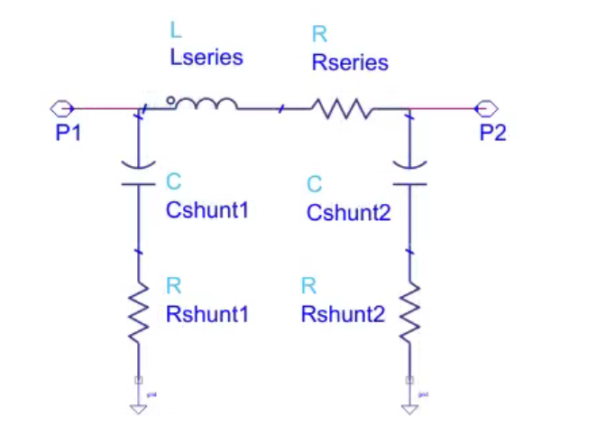
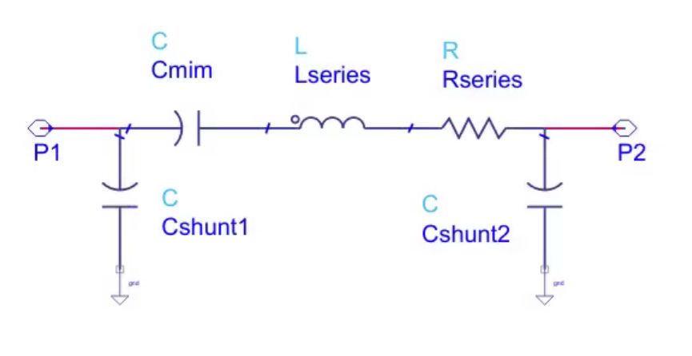
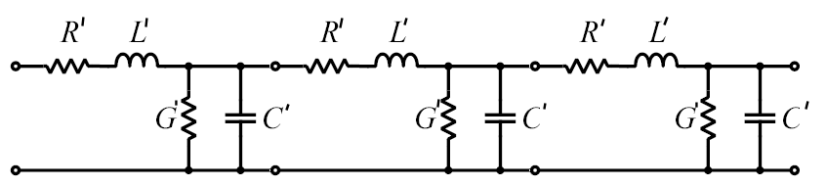

# Create lumped models from S-parameters

This is a collection of tools to convert S-parameters from RFIC EM simulation 
into a lumped model that can be used in all sorts of circuit simulation. 

The code for all model extractions requires Python3 with the skitkit-rf library.
https://scikit-rf.readthedocs.io/en/latest/tutorials/index.html

## Inductor (two port, no center tap) from S2P data
[pi_from_s2p](./pi_from_s2p)

## MIM capacitor from S2P data
[mim_from_s2p](./mim_from_s2p)

## Transmission line from S2P data
[rlgc_from_s2p](./rlgc_from_s2p)

