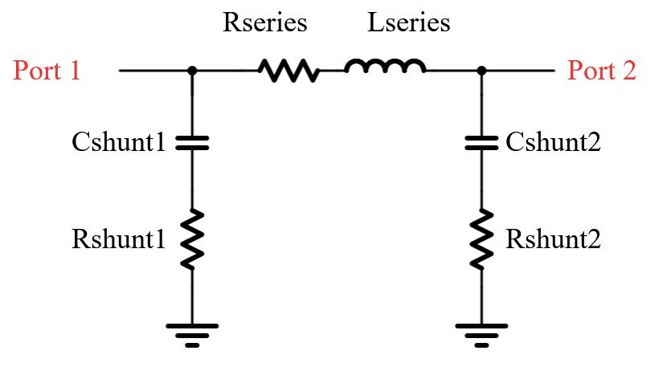
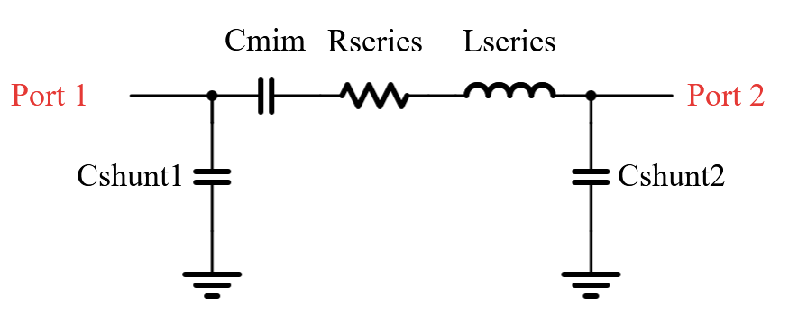
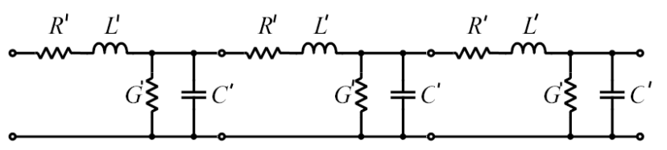

# Create lumped models from S-parameters

This is a collection of tools to convert S-parameters from RFIC EM simulation 
into a lumped model that can be used in all sorts of circuit simulation. 

## Inductor (two port, no center tap) from S2P data
[pi_from_s2p](./pi_from_s2p)

Simple narrowband model for 2-port inductors, extracted at a user defined target frequency.

[](./doc/inductor_model.png)

## Inductor (two port) and center-tapped inductor (three port), wideband model with substrate network
[inductor_fit](./inductor_fit)

Fully automatic wideband fit up to and beyond self resonance, with oxide capacitance,
bulk silicon network and skin effect. Exports a SPICE or Spectre subcircuit.

[](./inductor_fit/doc/inductor_fit_model.png)

## MIM capacitor from S2P data
[mim_from_s2p](./mim_from_s2p)

[](./doc/mim_model.png)

## Transmission line from S2P data
[rlgc_from_s2p](./rlgc_from_s2p)

[](./doc/rlgc_segments.png)

## Requirements

Python 3 with these libraries:

| library | needed by | license |
|---|---|---|
| [scikit-rf](https://scikit-rf.org) | all tools | BSD-3-Clause |
| [numpy](https://numpy.org) | all tools except mim_from_s2p | BSD-3-Clause |
| [matplotlib](https://matplotlib.org) | all tools (plots) | Matplotlib license (PSF-based) |
| [scipy](https://scipy.org) | inductor_fit, pi_from_s2p (also a scikit-rf dependency) | BSD-3-Clause |
| [packaging](https://packaging.pypa.io) | vector_fit (scikit-rf version check) | Apache-2.0 or BSD-2-Clause |
| [schemdraw](https://schemdraw.readthedocs.io) | only `inductor_fit/doc/draw_model.py` (schematic images) | MIT |

```
pip install scikit-rf numpy scipy matplotlib packaging
```

Tested with Python 3.13, scikit-rf 1.11.0, numpy 2.3.3, scipy 1.16.2, matplotlib 3.10.6.
vector_fit uses a different fit setting for scikit-rf older than 1.11.0.

## License

Copyright (C) 2026 Volker Muehlhaus <volker@muehlhaus.com>

This project is licensed under the GNU General Public License v3.0 or later, see [LICENSE](./LICENSE).

The required libraries (see [Requirements](#requirements)) are not included in this repository,
they are installed separately. Their licenses (BSD, MIT, Apache-2.0, Matplotlib/PSF-based) are
permissive and compatible with GPL-3.0.
