# inductor_fit

inductor_fit reads S-parameter data for a 2-port RFIC inductor (*.s2p), or for a
center-tapped inductor (*.s3p, see [below](#center-tapped-inductors-3-port-s3p)), and fits a
wideband equivalent circuit model with a physical substrate network. The fit runs
fully automatically: there is no extraction frequency to choose and no manual tuning.

Unlike [pi_from_s2p](../pi_from_s2p), which is exact only at one extraction frequency,
this model is fitted over the whole band up to and slightly beyond the self resonance
frequency (SRF). It reproduces L, Q, SRF and the S-parameters over that band.

# Model topology

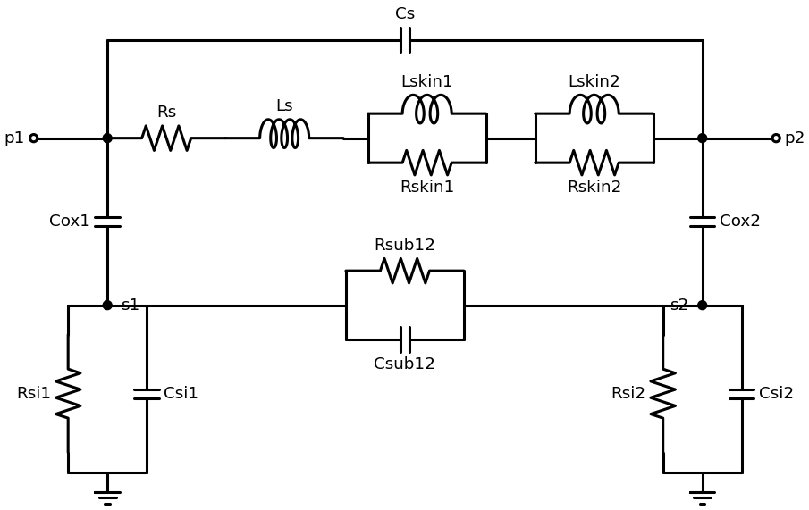

- Series branch: `Rs` and `Ls` are the DC resistance and inductance. The two skin sections
  `Rskin || Lskin` model the frequency-dependent R and L caused by skin effect, proximity
  effect and current redistribution. Each section adds inductance `Lskin` well below its
  corner frequency `Rskin/(2*pi*Lskin)` and resistance `Rskin` well above it. Two sections
  with different corners cover both a low-frequency L/R step and the high-frequency R rise.
  `Cs` is the capacitance across the coil (interwinding/underpass).
- Shunt branches: per port, the oxide capacitance `Cox` in series with the bulk silicon
  `Rsi || Csi`.
- Substrate coupling: `Rsub12 || Csub12` between the two substrate nodes. It is only part of
  the model when it is needed and physically plausible (see below).

## Substrate network: physically meaningful and as simple as possible

Two-port data does not always determine the substrate network uniquely. A complex network can
fit the data with element values that make no physical sense. The tool therefore uses the
simplest physically meaningful variant:

1. **Symmetry is decided from the data.** If the shunt branches `Y11+Y12` and `Y22+Y12` differ
   by less than 5% (RMS over the fit band), port 2 uses the same `Cox`/`Rsi`/`Csi` values as
   port 1. Otherwise the two ports get separate values.
2. **Substrate coupling is used only if it passes a physical plausibility check and improves
   the fit cost by more than 10%.** The check requires two things:
   - `Cox` stays within a factor of about 3 of the low-frequency shunt capacitance in the input data;
   - the coupling `Rsub12 || Csub12` is a secondary path, weaker than each port's own path
     to ground.

   The second condition excludes "shared substrate" solutions, where one port reaches ground
   only through the other port's network.
3. If `Rsi` is negligible against the `Cox` reactance, `Cox` effectively connects straight to
   ground, for example through a ground shield or a low-ohmic substrate contact. This is
   reported as a note, because the `Rsi`/`Csi` values are then not determined by the data.

The log lists the fit cost of every variant and the reason for any rejection. `--substrate`
forces a variant.

## Coil segments for electrically long inductors

Small mm-wave inductors simulated or measured up to several hundred GHz behave like a transmission line.
In the pi decomposition of the data, the apparent series inductance falls and the apparent
shunt capacitance rises toward the half-wave resonance. A single pi section cannot reproduce
this.

The tool therefore also fits versions where the coil is split into 2 or 3 equal segments.
The substrate network is distributed over the coil nodes with trapezoidal weights, blended
from the port 1 values to the port 2 values. The parameters are the same total values, so
segmenting adds no parameters. The tool picks the fewest segments whose fit cost is within
10% of the best.

## Basic model

With `--basic`, the topology is fixed: 1 segment, 1 skin section and no substrate coupling,
so the model is always unique. Port symmetry is still taken from the data. This keeps the same
topology for every fit, which is useful for example when generating data tables for machine
learning.

## Center-tapped inductors (3-port S3P)

3-port data with the ports p1, p2 and the center tap ct is fitted automatically with the
center-tapped inductor model:

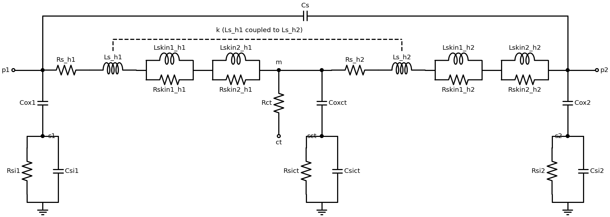

- **Half coils:** two half coils (p1 to the coil midpoint m, and m to p2), each with `Rs`, `Ls`
  and two skin sections. The inductances `Ls_h1` and `Ls_h2` are magnetically coupled with
  coefficient `k`. The coupling aids for differential current, so the differential inductance
  is `L1 + L2 + 2M` with `M = k*sqrt(Ls_h1*Ls_h2)`.
- **Capacitance and center tap lead:** `Cs` across the whole coil (p1 to p2), and the center
  tap lead resistance `Rct` from m to the ct port.
- **Substrate:** a `Cox-(Rsi||Csi)` network at p1, at p2 and under the center tap (m). There is
  no substrate coupling element.
- **Symmetry:** decided from the data (5% threshold), separately for three groups:
  - half coil inductances (`Ls`, `Lskin`), from the reactance of the half coil branches;
  - half coil resistances (`Rs`, `Rskin`), from their resistance;
  - the substrate networks at p1/p2, from the p1/p2 shunt branches.

  A symmetric layout can still have different resistance in the two halves, for example an
  underpass in one half. Tying only the symmetric groups keeps the values physical.
- **Coil segments:** chosen automatically (1–3 per half coil). The substrate network is then
  distributed along p1 → m → p2.
- **`--basic`:** 1 segment and 1 skin section per half coil.

**Why there is no center tap lead inductance:** a lead inductance `Lct` and the mutual
inductance `M` cannot be separated from terminal data. With the center tap as reference, the
port impedances are:
- `Z11' = Zhalf1 + Zct`
- `Z22' = Zhalf2 + Zct`
- `Z12' = Rct + jw(Lct - M)`

Increasing `Lct` and `M` by the same amount, while reducing both half coil inductances by that
amount, leaves every terminal response unchanged. This is the T-equivalent of coupled
inductors. The model therefore has no `Lct`, and the fitted `k` is the *effective* coupling,
which includes the lead inductance. `Rct` is separable, because it is the only real part in
`Z12'`.

What is fitted and reported, input data vs. model:

| response | definition |
|---|---|
| differential, ct AC grounded | `y_diff` of the p1/p2 2-port with ct shorted (VCO tank case) |
| differential, ct open | `y_diff` of the p1/p2 2-port with ct open |
| common mode at ct | `1/Y33`: impedance at ct with p1 and p2 grounded |
| single ended | `1/Y11`, `1/Y22` |

The error function also contains the delta decomposition of the 3-port, which is exact for any
3-port: branches `-Y12`, `-Y13`, `-Y23` and the row-sum shunts at p1, p2 and ct. `--ct-port`
selects which port of the S3P file is the center tap (default 3).

# Theory of operation

1. **Fit band**: the SRF is located in the data, as the frequency where Im(Y11) and Im(Y22)
   turn from inductive to capacitive. The fit uses data up to 1.2 x SRF. Data beyond that,
   such as higher-order resonances, is ignored. `--fmin` and `--fmax` override the band.
   Only a DC point is dropped; all other low-frequency data is kept, because it determines
   Rdc, Ls and Cox.
2. **Analytic starting values** from the pi decomposition of the Y-parameters:
   - Series branch `-Y12`: a staged R-L(-skin)||Cs fit, trying several seed corner
     frequencies for the skin sections.
   - Shunt branches `Y11+Y12` and `Y22+Y12`: `Cox` from the low-frequency capacitance;
     `Csi` and `Rsi` from the high-frequency limits of Cp and Rp (Yue/Wong style); then a
     small least-squares refinement of `Cox-(Rsi||Csi)`.
3. **Global fit** of the complete 2-port model with `scipy.optimize.least_squares` on
   log-scaled element values, from the starting values plus randomly perturbed starts.
   The fit is reproducible, because the random seed is fixed. The error function combines
   relative errors of:
   - Y11, Y22, the series branch, both shunt branches, and the substrate loss Re(shunt);
   - L and Q at port 1 (port 2 grounded), at port 2, and differentially, below 0.8 x SRF.

   The weights are constants at the top of the script. The number of coil segments is chosen
   first, using the substrate network without coupling. The substrate variant is chosen
   second, as described above.

The model Y-matrix is computed by nodal analysis, with the internal nodes eliminated by Kron
reduction. The model is also valid at DC.

# Prerequisites

Python3 with the scikit-rf, scipy, numpy and matplotlib libraries.
Regenerating the schematic image (`doc/draw_model.py`) also needs schemdraw.

# Usage

```
python inductor_fit.py <s2p or s3p file> [--basic] [--segments N] [--substrate VARIANT] [--ct-port N] [--fmin GHz] [--fmax GHz] [--noplot]
```

| option | meaning |
|---|---|
| `--basic` | fixed basic topology: 1 coil segment, 1 skin section, no substrate coupling |
| `--segments N` | use N coil segments (per half coil for S3P) instead of choosing automatically from 1, 2, 3 |
| `--substrate VARIANT` | `symmetric`, `asymmetric`, `symmetric+coupling` or `asymmetric+coupling` instead of `auto` (S3P: `symmetric` or `asymmetric` only) |
| `--ct-port N` | S3P only: port number of the center tap (default 3) |
| `--fmin`, `--fmax` | fit band limits in GHz (default: lowest data point to 1.2 x SRF) |
| `--noplot` | no plot windows, for example in batch runs |

Output files, written next to the input file:

| file | content |
|---|---|
| `<name>.txt` | log: model selection, element values, SRF / peak Q of input data vs. model, fit errors, notes and warnings |
| `<name>_model.sp` | SPICE subcircuit `inductor_model p1 p2` (S3P: `ct_inductor_model p1 p2 ct`, with `K` coupling elements), with explicit elements per segment |
| `<name>_model.s2p` / `.s3p` | model S-parameters on the frequency grid and in the port order of the input data, for comparison |

Example, using the sample_inductor.s2p file included in the [examples](./examples) folder:
```
python inductor_fit.py examples/sample_inductor.s2p
```
```
Fit cost for number of coil segments (symmetric substrate network): 1: 0.01419, 2: 0.01288, 3: 0.0129
Number of coil segments: 2 (fewest segments with cost within 1.1 x best)
Port symmetry: shunt branches differ by 1.46 % RMS (symmetric), threshold 5 %
Fit cost for substrate network variants:
  symmetric           : 0.01288
  symmetric+coupling  : 0.01287   not physical: coupling dominates port 1 substrate path, coupling dominates port 2 substrate path
Substrate network: symmetric (simplest physical variant with cost within 1.1 x best)

Fitted model element values, totals over all segments (seed values in brackets)
Series branch
  Rs     :        1.542 Ohm   (1.548 Ohm)
  Ls     :        1.567 nH   (1.604 nH)
  ...
Shunt branch port 1
  Cox1   :         59.5 fF   (57.79 fF)
  Rsi1   :         3533 Ohm   (3252 Ohm)
  Csi1   :        18.32 fF   (19.12 fF)
Shunt branch port 2 (symmetric: same as port 1)
  ...
                                      data     model
  SRF port 1 (port 2 shorted) [GHz]:    20.910    20.888
  SRF port 2 (port 1 shorted) [GHz]:    20.852    20.888
  SRF differential            [GHz]:    23.239    23.442
  Peak Q11                         :     18.57     18.49
  Frequency of peak Q11       [GHz]:     6.900     7.125
  Peak Q differential              :     22.51     22.41
  Frequency of peak Q diff    [GHz]:     9.075     8.925
...
RMS relative error over fit band [%]: Y11 0.75, Y22 0.75, Y21 0.77, S21 0.76
RMS relative error below 0.8 x SRF [%]   : L11 1.05, Q11 0.51, L22 0.65, Q22 1.04
```

The plots compare the input data (simulated or measured S-parameters) and the model. The gray area marks data that was not used for
fitting.

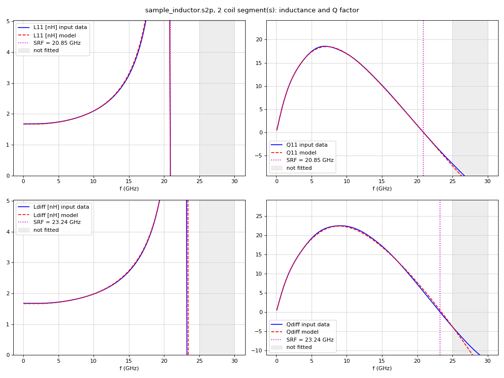

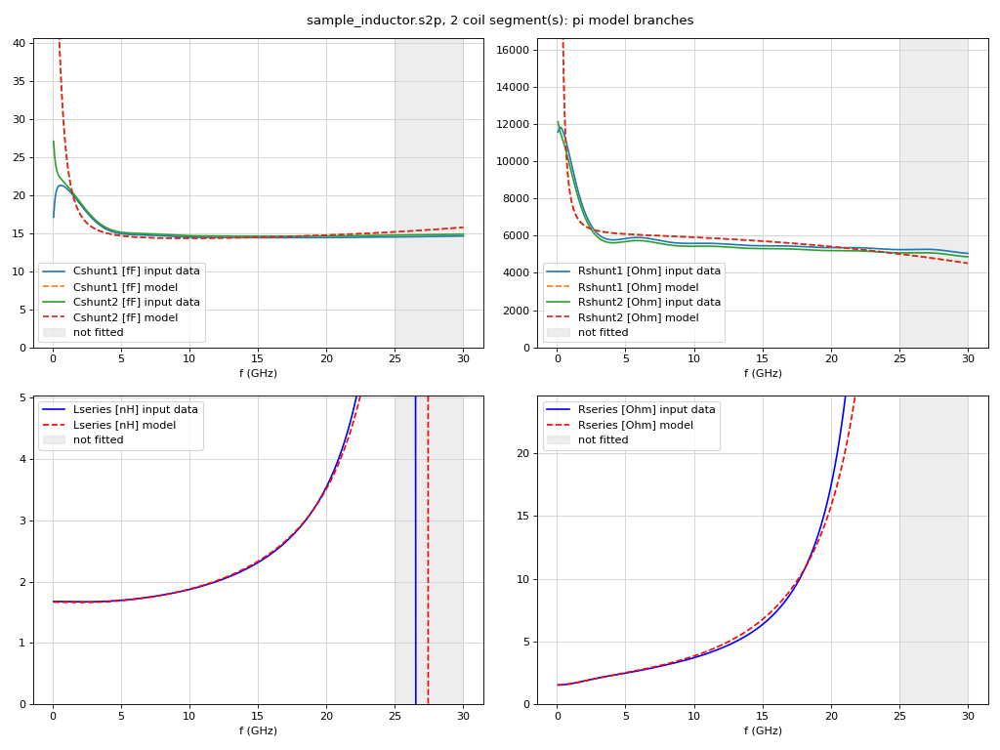

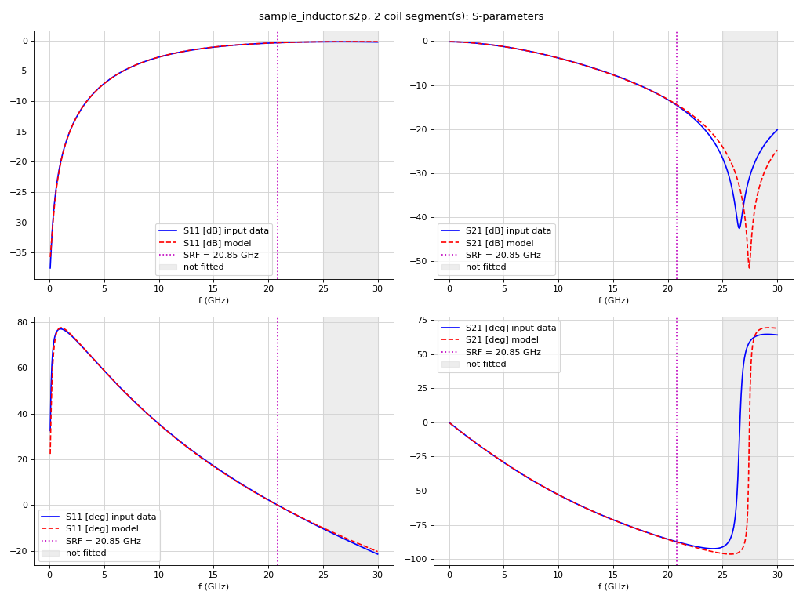

## Example: 74 pH mm-wave inductor

[inductor_74p.s2p](./examples/inductor_74p.s2p) is EM-simulated up to 350 GHz. With the basic model
(1 segment, 1 skin section), the differential response cannot follow the data:

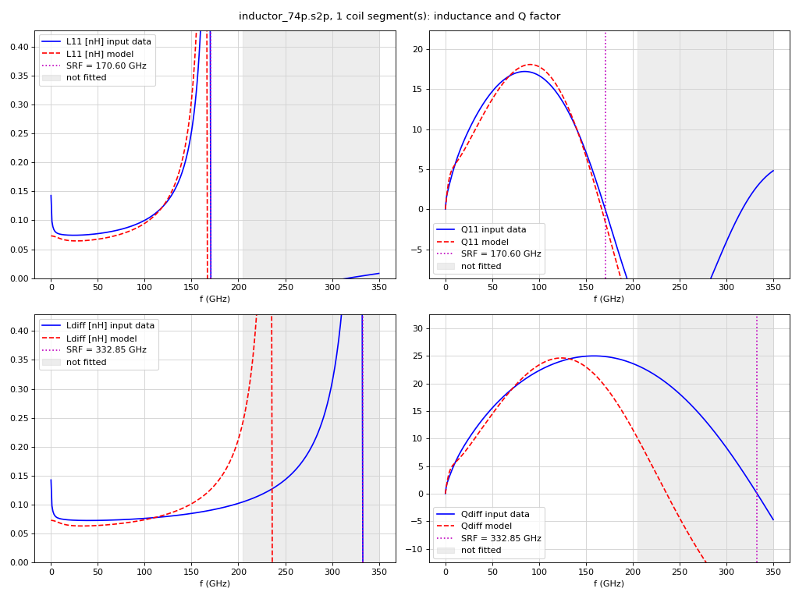

With automatic segmentation, the tool picks 3 segments. The model then follows L and Q up to
350 GHz, well beyond the fit band, including the differential SRF at 333 GHz:

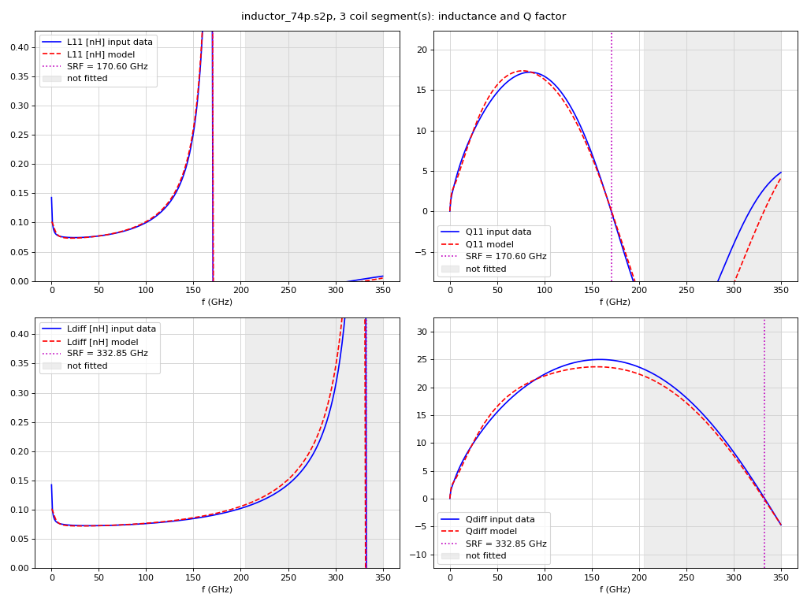

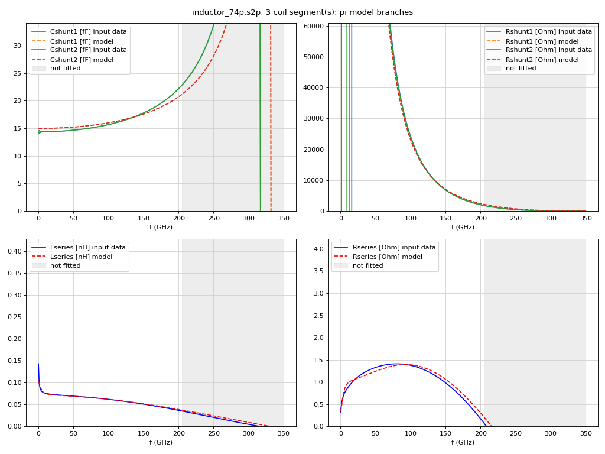

## Example: center-tapped inductor (IHP SG13G2 inductor3)

[final_inductor3_N2_do82.29_w4_s4.s3p](./examples/final_inductor3_N2_do82.29_w4_s4.s3p) is an
inductor3 (2 turns, 82.29 µm outer diameter, 4 µm width and spacing), simulated with Palace up
to 60 GHz. Port 3 is the center tap.
```
python inductor_fit.py examples/final_inductor3_N2_do82.29_w4_s4.s3p
```
```
Number of coil segments per half coil: 2 (fewest segments with cost within 1.1 x best)
Symmetry from the data (RMS difference, threshold 5 %):
  half coil inductance  :   0.63 % -> symmetric
  half coil resistance  :   6.00 % -> asymmetric
  substrate at p1/p2    :   5.91 % -> asymmetric
...
Derived values
  Half coil inductance at DC (Ls + Lskin)     [nH] : 0.1728, 0.1728
  Mutual inductance M = k*sqrt(Ls_h1*Ls_h2)   [nH] : 0.06249
  Differential inductance at DC (L1+L2+2M)   [nH] : 0.4706
  Differential resistance at DC (Rs1+Rs2)   [Ohm] : 1.718

                                                                   data     model
  Peak Q differential, center tap AC grounded               :     18.76     18.16   at 37.500 / 35.250 GHz
  Peak Q common mode at center tap                          :     10.26     10.34   at 60.000 / 60.000 GHz
  Peak Q port 1 (p2, ct grounded)                           :     11.05     11.12   at 51.750 / 46.500 GHz
...
RMS relative error over fit band [%]: Y11 2.37, Y22 3.44, Y33 2.45, Y21 3.52, Y31 1.98, S21 1.95, S31 0.40
```
The two half coils have the same inductance but different resistance. The model therefore ties
only the inductances of the halves (effective k = 0.41), and fits the resistances separately.

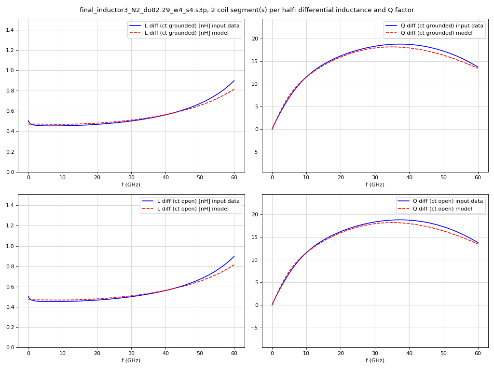

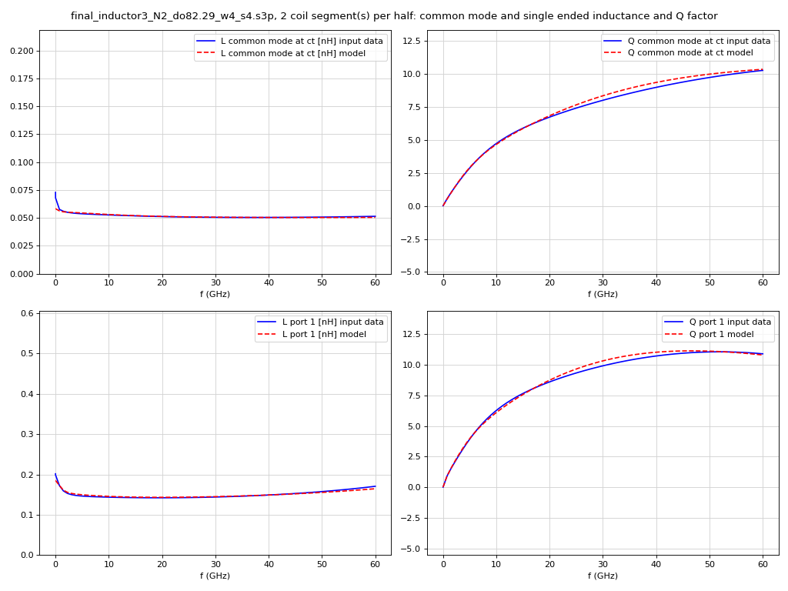

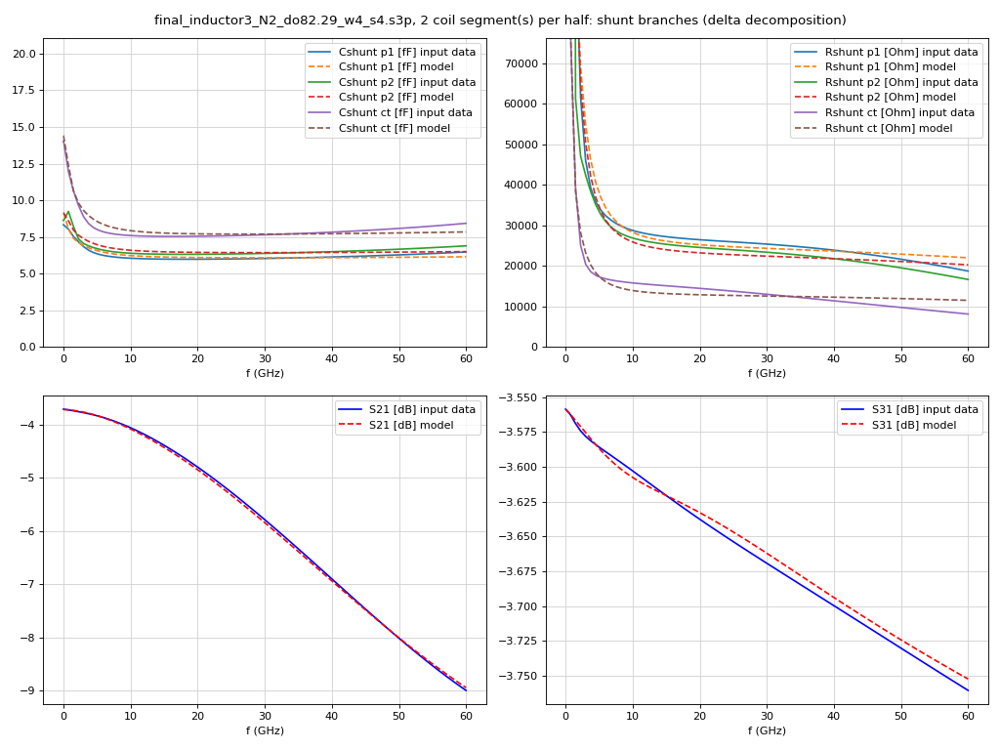

# Accuracy and notes

- Check the input data vs. model SRF and peak Q values and the plots in the log. The Y-parameter
  RMS error is dominated by the low-frequency points, where |Y| is largest. For data with a
  low-frequency L step, it is therefore much larger than the S21 error.
- **Notes about elements at their bounds.** An element that ran to the bound where it has no
  effect (for example `Cs` -> 0 for a single-turn coil, or `Rsi` -> open) is reported as a
  NOTE: the data simply doesn't need it. Any other element at a bound is reported as a
  WARNING.
- **Low-frequency L step.** Some EM data shows a strong drop of inductance in the lowest GHz,
  for example 74 pH: 0.143 nH at 10 MHz -> 0.075 nH above 5 GHz. The two skin sections only
  partly follow it, because there are few data points in that range. The effect on circuit
  behaviour is small, because wL is tiny there.
