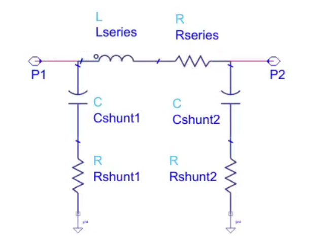
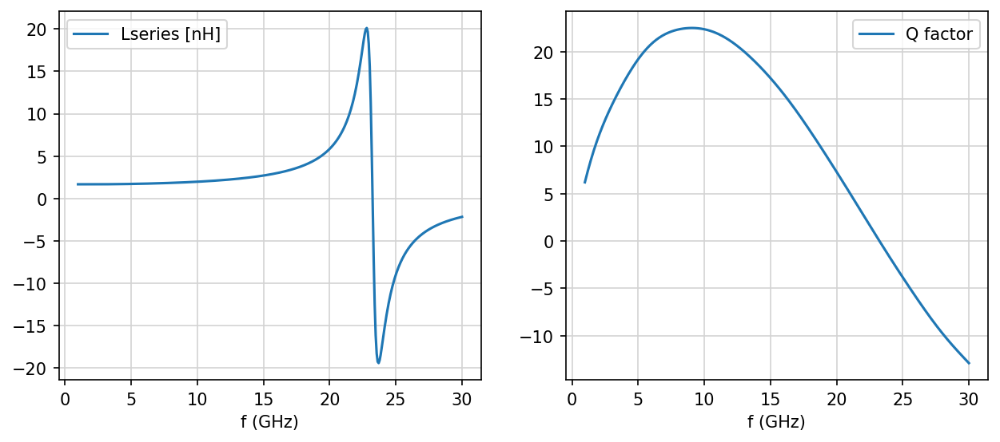
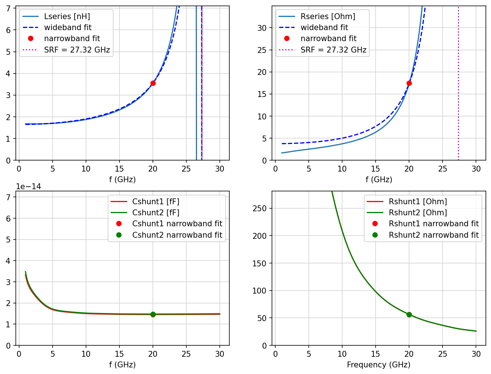
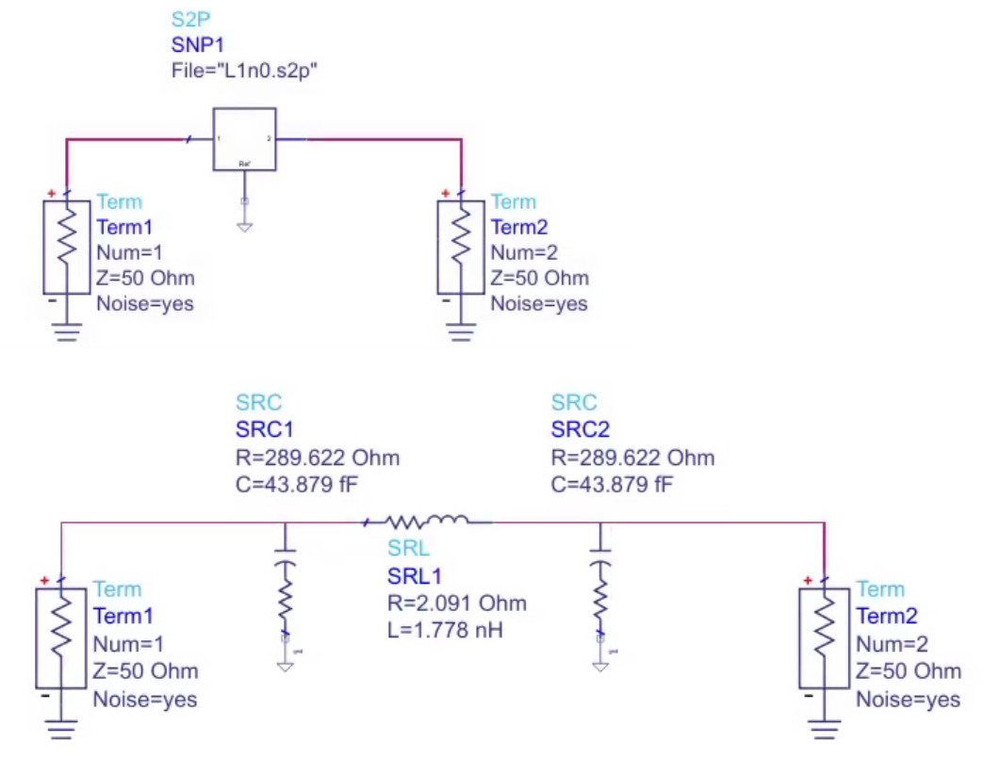
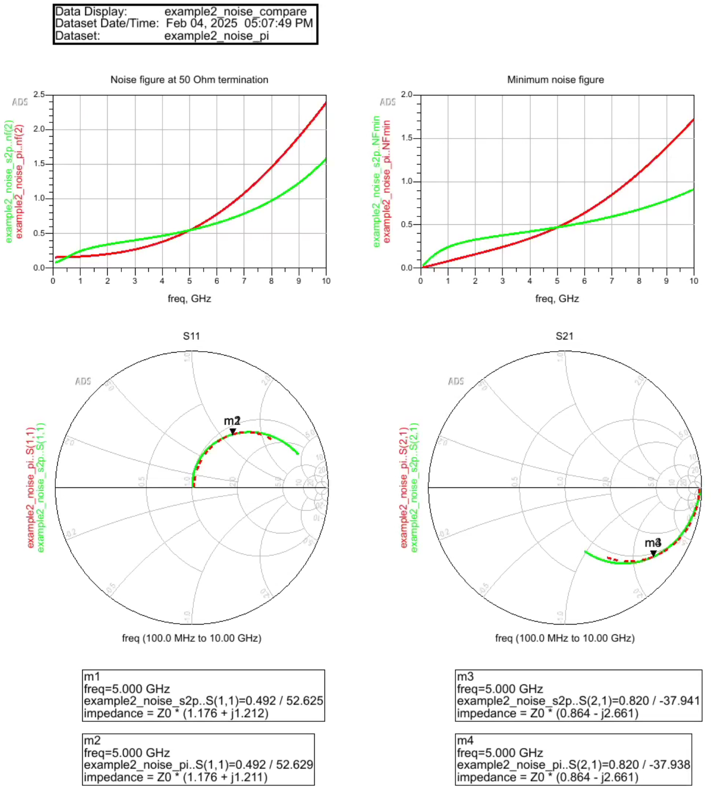
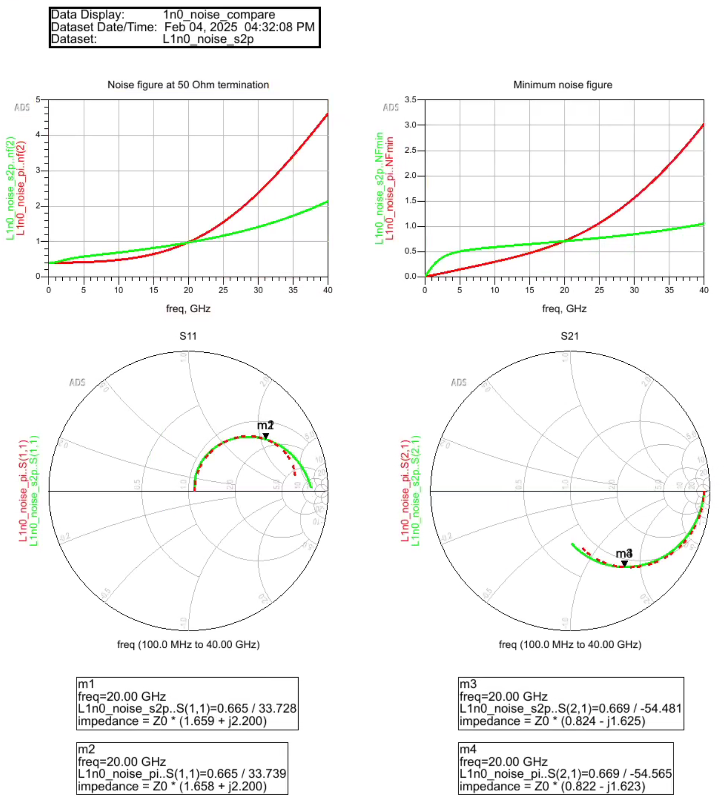

# pi_from_s2p

pi_from_s2p reads S-parameter data (*.s2p) for an RFIC inductor 
and calculates component values for simple narrowband pi model. 



# Theory of operation:
The S-parameters at one user defined frequency are extracted 
and the corresponding series and shunt path elements are calculated.
For the series path, a series combination of L and R is assumed.
For the shunt path at each port, an series combination of C and R is assumed.

This topology matches the requirements of RFIC inductor modelling and 
ensures DC isolation from the coil to the substrate node, even if the 
underlying S2P data is not perfectly accurate at DC.

This narrowband pi model is exact at the extraction frequency, but not
wideband. A fully wideband physical model for RFIC inductors would also
need shunt path elements with Coxide in series to Csubstrate ||
Rsubstrate; that is still not implemented here. Self resonance (a
capacitor across the coil) and skin effect (a frequency-dependent rise
in series resistance) *are* now covered separately by a curve-fitted
wideband series branch model, see below.

# Wideband series branch fit (self resonance + skin effect)

In addition to the single-frequency pi model above, the tool fits a
more detailed series branch model across the full measured frequency
band: the plain `Rseries`/`Lseries` arm gains a skin-effect section
(`Rskin` in parallel with `Lskin`) in series with it, and a capacitor
`Csrf` in parallel with the whole thing to capture self resonance:

```
        Rseries  Lseries   skin
Port1 ●──[R]──[L]──[Zskin]──────● Port2
  │      │                         │
  │      └───────[Csrf]────────────┘
  │                                 │
[Rshunt1]                     [Rshunt2]
[Cshunt1]                     [Cshunt2]
  │                                 │
 GND                               GND

  Zskin = Rskin parallel with Lskin (the "skin effect" section):
        ┌──[Rskin]──┐
   ●────┤         ├────●
        └──[Lskin]──┘
```

`Csrf` and `Zskin` connect only into the series L-R arm — neither is
connected to a shunt branch, and the shunt branches (`Cshunt1`/`Rshunt1`,
`Cshunt2`/`Rshunt2`) are unaffected, still extracted narrowband at the
single extraction frequency exactly as before. `Zskin` behaves like a
short at DC (so the branch looks like plain `Rseries`+`Lseries` at low
frequency) and like a resistor `Rskin` at high frequency (so the branch's
resistance rises toward `Rseries+Rskin`), with the transition centred at
a "corner frequency" `Rskin/(2*pi*Lskin)`.

Unlike the rest of the script, this series branch is not solved in
closed form at one frequency. `Rskin`, `Lskin` and `Csrf` are fit with
`scipy.optimize.least_squares` against the series branch admittance
data (fit in two stages: a simpler R-L||Csrf fit first, whose result
seeds the full 5-parameter fit, for better convergence). `Rseries` and
`Lseries` are then recalibrated together, holding `Rskin`/`Lskin`/`Csrf`
fixed, so the model matches both closely right at the extraction
frequency you asked for — since that's the frequency that actually
matters, not just whatever a whole-band average happens to produce.
Matching a target impedance (real and imaginary part) at one frequency
by adjusting `Rseries` and `Lseries` is an exactly-determined 2-equation,
2-unknown problem, solved with `scipy.optimize.fsolve`.

Two restrictions limit which data the fit (the `Rskin`/`Lskin`/`Csrf` stage;
the recalibration above always targets the exact extraction frequency
regardless of these) is allowed to use:
- Only data at or below the series branch's own self resonance — a
  single R-L(+skin)||C branch can only represent one resonance, so
  fitting data beyond it would just pollute the fit elsewhere for no
  benefit. That resonance is located directly from the raw data (where
  the raw, unmodeled `Lseries` first goes from inductive to capacitive),
  separately from the *model's* self resonant frequency (SRF) below,
  which is found numerically as the frequency where the *fitted* branch
  turns from inductive to capacitive, and should end up close to the
  data's own resonance if the fit is good.
- Only data at or above 10% of the extraction frequency — very low
  frequency points mainly pin down DC behaviour, which isn't what a fit
  focused on the extraction frequency should spend its effort matching.

Because this is a curve fit rather than an exact per-frequency
extraction, a fit-quality RMS error is also reported (over the same
sub-band that was fit). Three warnings can appear: if the fitted SRF
falls outside the measured range (extrapolated, less trustworthy); if
the fitted skin corner frequency falls outside the measured range (the
`Rseries`/`Rskin` split is then underdetermined — many combinations fit
the in-band data equally well — and only their sum, the high-frequency
resistance asymptote, should be trusted); and if the requested
extraction frequency itself is above the data's self resonance (the
series branch model was only fit below that point).

Example, using the sample_inductor.s2p file included in this repository:
```
python pi_from_s2p.py sample_inductor.s2p 20
```
```
Wideband series branch fit (R + skin Rskin||Lskin + Csrf, fit band 2.000-26.529 GHz)
Fit low-frequency cutoff (0.1x extraction freq, excluded below this) [GHz]: 2.000
Data self resonance (fit excludes data above this) [GHz]: 26.529
Series L (DC)              [nH] : 1.646
Series R (DC)              [Ohm]: 2.713
Skin effect R (Rskin)      [Ohm]: 1.032
Skin effect L (Lskin)      [pH] : 684247.721
Skin effect corner freq    [GHz]: 0.000
Series R (high-f asymptote, R+Rskin) [Ohm]: 3.745
Csrf (parallel)            [fF] : 20.613
Series L at 20.000 GHz (model)  [nH] : 3.552 (narrowband target: 3.552)
Series R at 20.000 GHz (model)  [Ohm]: 17.467 (narrowband target: 17.467)
Self resonant frequency (SRF) [GHz]: 27.322
Fit RMS error [mS]              : 0.6709 (5.37% relative)
WARNING: skin effect corner frequency (0.000 GHz) is outside the measured frequency range (0.975-30.000 GHz) - the Rskin/Lskin split is underdetermined for this dataset, only the total series R (high-f asymptote) is meaningful
```
`Series L/R at 20.000 GHz (model)` both match their narrowband targets
exactly — that's the recalibration working. For this particular sample
part the skin corner lands below the measured band, so (per the
warning) the `Rseries`/`Rskin` split isn't individually meaningful, only
their sum. The fitted curve and the SRF frequency are also overlaid on
the `Lseries`/`Rseries` plot shown further below, in the Usage section —
notice the fitted curve now passes exactly through the narrowband point
at 20 GHz on both plots.

# Prerequisites
The code requires Python3 with the scikit-rf and scipy libraries.
https://scikit-rf.readthedocs.io/en/latest/tutorials/index.html

# Usage
Ro run the pi model extraction, specify the *.s2p file as the first parameter, 
followed by the extraction frequency in GHz.

example, using the sample_inductor.s2p file included in this repository:
```
python pi_from_s2p.py sample_inductor.s2p 20
```
output: 
```
Extract simple inductor pi model from S2P S-parameter file
S2P frequency range is 0.0 to 30.0 GHz
Extraction frequency: 20.0 GHz

Differential inductor parameters
Effective series L  [nH] : 5.904 @ 20.025 GHz
Effective series R  [Ohm]: 102.387 @ 20.025 GHz
Differential Q factor    : 7.26 @ 20.025 GHz
----------------------
L_DC      [nH] : 1.676
R_DC      [Ohm]: 1.655
Peak Q         : 22.51 @ 9.075 GHz


Pi model extraction (narrowband) at 20.025 GHz
Series L  [nH] : 3.552
Series R  [Ohm]: 17.467
Shunt C @ port 1 [fF] : 14.559
Shunt R @ port 1 [Ohm]: 56.242
Shunt C @ port 2 [fF] : 14.773
Shunt R @ port 2 [Ohm]: 56.337
```
(the "Wideband series branch fit" section that follows this in the
actual output is shown separately above, since it's covered in its own
section here)

In addition to the values printed at the command line, you also get a 
plot of L and Q in differential mode operation (note the self-resonance
spike where `Ldiff` swings from strongly inductive to strongly
capacitive), and a plot of the extracted series and shunt path values
with a visual marker at the extraction frequency, now also showing the
wideband fit curve and the self-resonance frequency marker described
above.





# Accuracy

Note that the narrowband pi model values do not give accurate wide band 
reponse of the S2P data, they are exact only at the extraction frequency.
The underlying model does not exactly replicate the physics on an RFIC 
inductor, and you will notice that frequency dependence of values like 
series resistance looks unexpected: the plots show series R decreasing
with frequency. This is not intuitive, but correct in the context of 
this model: the overall model gives the exact impedances at the 
extraction frequency!

This does not apply the same way to the wideband series branch fit:
`Rskin`, `Lskin` and `Csrf` are fit across a sub-band (from 10% of the
extraction frequency up to self resonance) rather than picked at one
frequency, so check the reported fit RMS error (and whether an
"extrapolated SRF", "skin effect corner frequency", or "extraction
frequency above self resonance" warning was printed) to judge how well
that part of the model matches the data. `Rseries` and `Lseries` are
different again — they're recalibrated together to match closely right
at the extraction frequency (see above), so a larger RMS error there
reflects that trade-off rather than a worse fit in general.

Two examples will be shown below, with S-parameters and noise data
compared between S2P data and extracted pi model.


# Noise simulation

It is reported that Qucs-s can't do noise simulation with S2P files, 
so one use case of this simple pi model extraction is to enable noise 
simulation by replacing the S2P data block with an equivalent circuit model.

To verify the noise of the pi model against the S2P data, two test cases
have been evaluated: a 2nH inductor extracted at 5 GHz and a 1nH inductor 
extracted at 20 GHz. For this test, Keysight ADS circuit simulation was used, 
which supports noise simulation with S-parameter files.

example2, 1nH extracted at 5 GHz:



The comparison of S2P and pi model is show below. Values agree exactly 
for noise figure at 50 Ohm load, minimum noise figure and S11, S21 at 
the 5 GHz extraction frequency.



L1n0, 1nH extracted at 20 GHz:



Again, values agree for noise figure at 50 Ohm load, minimum noise 
figure and S11, S21 at the 20 GHz extraction frequency.

# Result from this tool is not a fully wideband model!

The shunt branches of the pi model are still narrowband/exact-at-one-
frequency only, and while the series branch fit now covers both self
resonance and skin effect, it still does not model oxide/substrate
coupling, and for parts where the skin corner falls below the measured
band (see the warning described above) the DC/AC resistance split is
underdetermined. A fully wideband physical model for RFIC inductors
would require additional elements in the equivalent circuit model, to
replicate the physical device structure. Such a workflow has been
demonstrated here:
https://muehlhaus.com/products/equivalent-circuit-model-fit-for-rfic-inductors

This also requires circuit optimization after initializing components
with pre-calculated starting values, and is beyond the scope of this 
simple pi model extraction.


