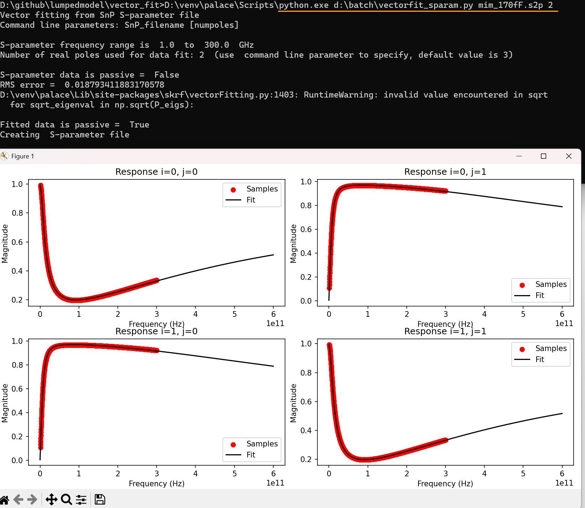
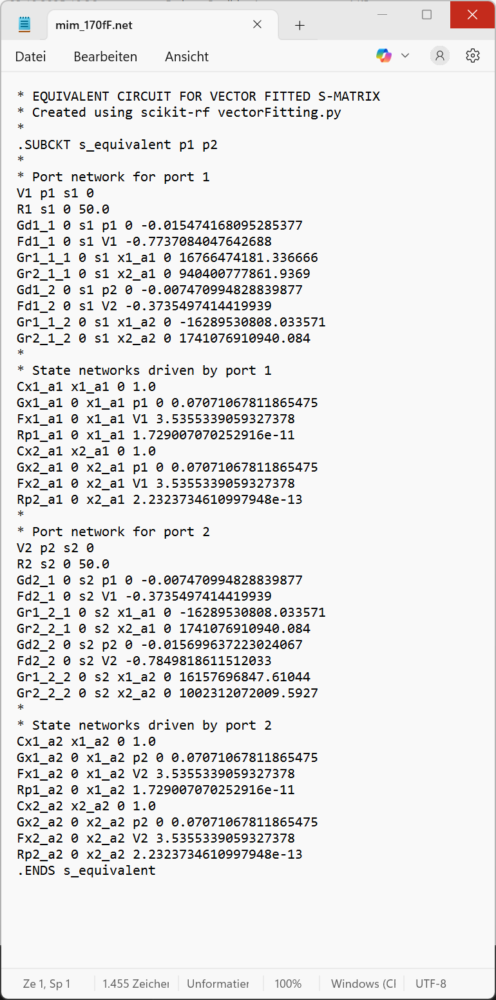

# vectorfit_sparam

This script reads n-port S-parameter data (*.snp) and calculates 
a wide band circuit model fit, using scikit-rf vector fit functionality.



Vector fit is done for each branch of the n-port data, using the circuit
order specified by the user as a commandline parameter. If no value is
specified, order = 3 will be used.

Not all input data is suitable, and you will need to test which order 
gives a reasonable fit quality. The resulting circuit model uses controlled
sources, so results might not even be physical, use with care!


# Prerequisites
The code requires Python3 with the skitkit-rf library.
https://scikit-rf.readthedocs.io/en/latest/tutorials/index.html

# Usage
To run the vector fit, specify the *.snp file as the first parameter, 
followed by the moderl order to be used for the fit (default value = 3).

example:
```
(scikit) python.exe d:\batch\vectorfit_sparam.py mim_170fF.s2p 2
Vector fitting from SnP S-parameter file
Command line parameters: SnP_filename [numpoles]

S-parameter frequency range is  1.0  to  300.0  GHz
Number of real poles used for data fit: 2  (use  command line parameter to specify, default value is 3)

S-parameter data is passive =  False
RMS error =  0.018793411883170578
D:\venv\palace\Lib\site-packages\skrf\vectorFitting.py:1403: RuntimeWarning: invalid value encountered in sqrt
  for sqrt_eigenval in np.sqrt(P_eigs):

Fitted data is passive =  True
Creating  S-parameter file
```

The result of the fit is stored in netlist format.


# Accuracy
You can see from the plot if the model fits well. As an additional check, 
an S-parameter output file with suffix ".predicted" is created, which
correspondonds to the fitted model. This can be used to verify the fit 
against input data.

